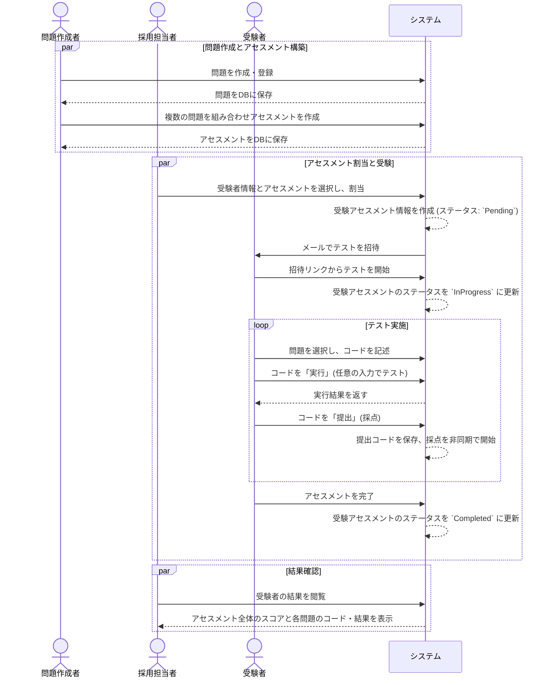

# 要件定義書

## 1. プロジェクト概要

本プロジェクトは、プログラミングスキルを評価・測定するためのオンラインコーディングテストプラットフォームを構築することを目的とする。採用候補者のスクリーニング、社内エンジニアのスキル育成、およびデータに基づいた採用・教育戦略の立案を支援する。

## 2. ユーザー要件

### 2.1. ペルソナ

| ペルソナ | 役割 | 主な要求 |
| :--- | :--- | :--- |
| **採用候補者** | 求職者 | - **自分に割り当てられたアセスメント（問題セット）を受験したい** - **アセスメント内の問題を自由に移動したい** - 直感的で使いやすいインターフェースでテストに集中したい - 複数のプログラミング言語から得意なものを選択したい - コードの実行結果を即座に確認したい |
| **採用担当者** | 採用プロセス管理者 | - **複数の問題からなるアセスメントを候補者に割り当てたい** - 候補者情報を一元管理したい - メールで簡単にテストを候補者に配信したい - **候補者ごとのアセスメント全体の進捗やスコアを確認したい** - **候補者の過去の受験結果と比較して成長度合いを見たい** |
| **採用面接官** | 技術評価者 | - **アセスメント全体のスコアと、個別の問題のコードを閲覧したい** - コードの提出履歴やリプレイ機能で思考プロセスを確認したい - 不正行為（例: コピペ）の可能性を検知したい |
| **問題作成者** | エンジニアリングマネージャー等 | - **複数の問題を組み合わせてアセスメント（問題セット）を作成・管理したい** - コーディング問題を作成・編集・管理したい - 問題に難易度やカテゴリを設定したい - テストケースを設定したい |
| **社内エンジニア** | (旧: 受講者) | - 研修課題としてアセスメントに取り組みたい - 自身の解答と模範解答を比較して学習したい - 過去の自分の解答と比較して、スキルアップを実感したい - **自分の現在スキルが、全社的なスキルマップ上でどの位置にあるか可視化したい** - **次に習得すべきスキルや、それに対応する課題を知りたい** |
| **エンジニアリングマネージャー** | チームリーダー, メンター | - **チームメンバーのスキルセットを網羅的に把握したい** - **スキルマップを元に、メンバーの育成計画や1on1のトピックを検討したい** |

## 3. 機能要件

### 3.1. 機能一覧

| 大項目 | 機能 | MVP | 詳細 |
| :--- | :--- | :--- | :--- |
| **プラットフォーム管理** | 対応言語・バージョン管理 | ❌ | - 管理者は、サポートする言語とバージョンを登録・編集できる - 各バージョンに公式ドキュメント等のURLを紐付ける |
| **アセスメント管理** | アセスメント作成・編集 | ❌ | - 複数の問題を組み合わせてアセスメントを作成できる - アセスメントに名称、説明、総合制限時間を設定できる - アセスメント内の問題の順序を設定できる - **アセスメントごとに、開始前の注意事項や終了後の案内文をMarkdownで設定できる。** |
| **ユーザー管理** | ユーザー登録・認証 | ✅ | 役割に基づいた権限管理を行う |
| | プロフィール管理 | ✅ | 氏名、メールアドレス等の基本情報を管理する |
| **問題管理** | 問題作成・編集 | ✅ | - 問題タイトル、カテゴリ、難易度、Markdownの問題文、コード雛形、ヒントを登録・編集できる - **問題ごとに、想定解答時間を5分単位で設定できる。** |
| | テストケース管理 | ✅ | - 複数のテストケース（入力、期待出力、公開/非公開）を設定できる |
| | **問題自動生成** | ❌ | - **(Post-MVP)** 難易度（Easy, Medium, Hard）と問題の観点（例: 配列操作, 木構造, 動的計画法）を指定する。 - 指定された条件に基づき、AIが問題文、解説、コード雛形、テストケースを自動生成する。 |
| **テスト受験** | **アセスメント受験** | ❌ | - **割り当てられたアセスメントを開始・中断・再開できる** - **アセスメント内の問題をナビゲーションできる** |
| | コードエディタ | ✅ | リアルタイムでコードを記述・編集できる |
| | 言語選択 | ✅ | - 言語とバージョンを選択できる |
| | コード任意実行 | ✅ | 任意の入力値でコードを自由に実行し、結果を確認できる（採点対象外）。 |
| | コード提出・採点 | ✅ | 全てのテストケースでコードを実行し、結果を正式な提出として保存・採点する。 |
| **テスト管理** | **アセスメント割当** | ❌ | - 候補者に対してアセスメントの受験を割り当てる |
| | テスト配信 | ❌ | 候補者に対してメールでテスト受験の招待を送信する |
| | 結果閲覧 | ✅ | - **アセスメント全体のスコアと、個別の問題の提出状況を閲覧できる** |
| | **パフォーマンス比較分析** | ❌ | - **(Post-MVP)** 受験者ごとに、過去に受験した全アセスメントの結果を一覧表示・比較できる。 - 総合スコアや解答時間の推移を時系列グラフで可視化する。 - 問題のカテゴリや難易度ごとにスコアの変遷を分析できる。 |
| **育成支援** | **スキルマップ管理** | ❌ | - **(Post-MVP)** `roadmap.sh`等を参考に、分野ごとのスキルツリー（スキルマップ）を管理者が作成・編集できる。 |
| | **スキルマップ連携ダッシュボード** | ❌ | - **(Post-MVP)** エンジニアは自身のスキルマップを閲覧できる。 - アセスメント結果に基づき、各スキルノードの習熟度が自動で更新・可視化される。 - 各スキルノードから、関連する問題に挑戦できる。 |

### 3.2. MVP (Minimum Viable Product) の定義

MVPは、製品が市場で価値を提供できる最小限の機能セットを指す。本プロジェクトでは、以下の機能に絞って迅速なリリースを目指す。

- **ユーザー管理**: ユーザー登録、ログイン機能
- **問題管理**: 問題作成者による、単一の問題（問題文、テストケース、コード雛形）の作成・編集機能
- **テスト受験**: 受験者による、単一問題のコード記述、実行、提出機能
- **採点**: 提出されたコードの自動採点機能
- **結果閲覧**: 提出されたコードと採点結果の基本的な閲覧機能

*補足: MVP段階では、複数の問題を束ねる「アセスメント」の概念は含めず、単一の問題を解くサイクルを確立することに集中する。*

## 4. 非機能要件

| 項目 | 要件 |
| :--- | :--- |
| **パフォーマンス** | - ページ表示: 主要なページの表示時間は2秒以内であること。 - コード実行: ユーザーが「実行」ボタンを押してから、結果が表示されるまでの時間は、平均3秒以内であること。 - コード採点: ユーザーが「提出」ボタンを押してから、採点が完了するまでの時間は、95%が15秒以内であること。 |
| **セキュリティ** | - ユーザー認証: パスワードはハッシュ化して保存し、セキュアな認証方式（例: JWT）を採用すること。 - コード実行環境: ユーザーが提出したコードは、サンドボックス化された環境（Dockerコンテナ）で実行し、ホストシステムや他のユーザーデータへのアクセスを完全に分離すること。 - 入力値の検証: 全てのユーザー入力は、サーバーサイドで厳格にバリデーションを行うこと（SQLインジェクション、XSS対策）。 |
| **可用性** | - システム稼働率: 99.5%以上を目指す。 - データベースは定期的にバックアップを取得し、障害発生時に復旧できること。 |
| **UI/UX** | - レスポンシブデザイン: デスクトップPCのブラウザで快適に利用できること。（モバイル対応はMVP後） - 直感的な操作性: 専門的な知識がない採用担当者でも、問題の作成や候補者の管理が直感的に行えること。 |
| **開発プロセス** | - TDD を原則採用し、RED→GREEN→REFACTOR のサイクルで実装する。 - 各PRで変更仕様に対応するテストを追加し、主要な自動チェック（lint/typecheck/unit/build）を通過する。 |

## 5. ワークフロー定義

### 5.1. 概要

コーディングテストのプロセスは、「問題・アセスメント作成」「アセスメントの割当と受験」「結果確認」の3つのフェーズに大別される。

### 5.2. シーケンス図

