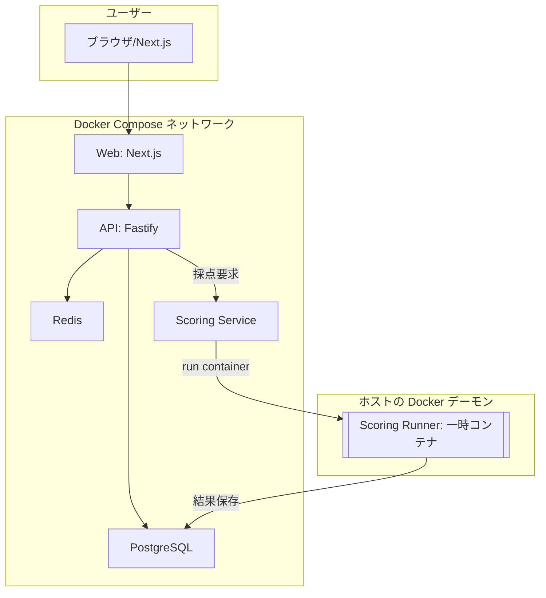
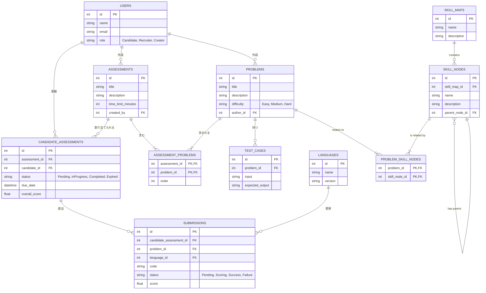
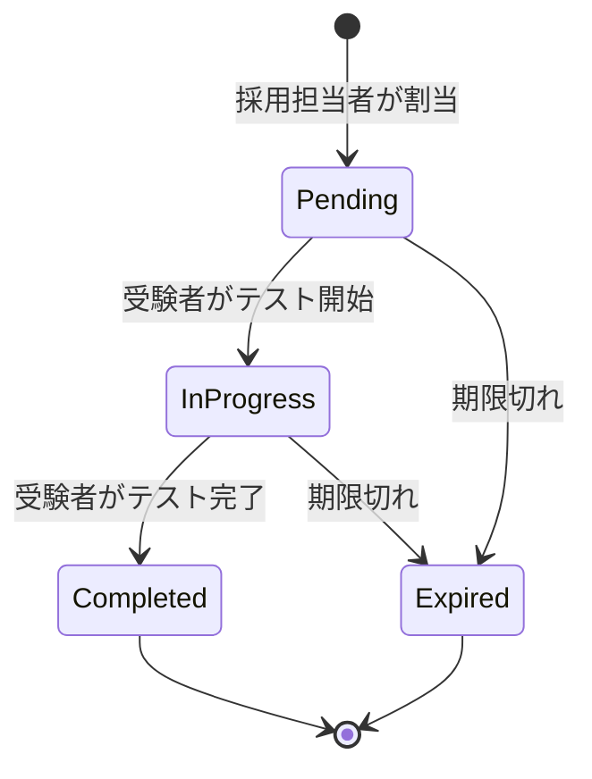
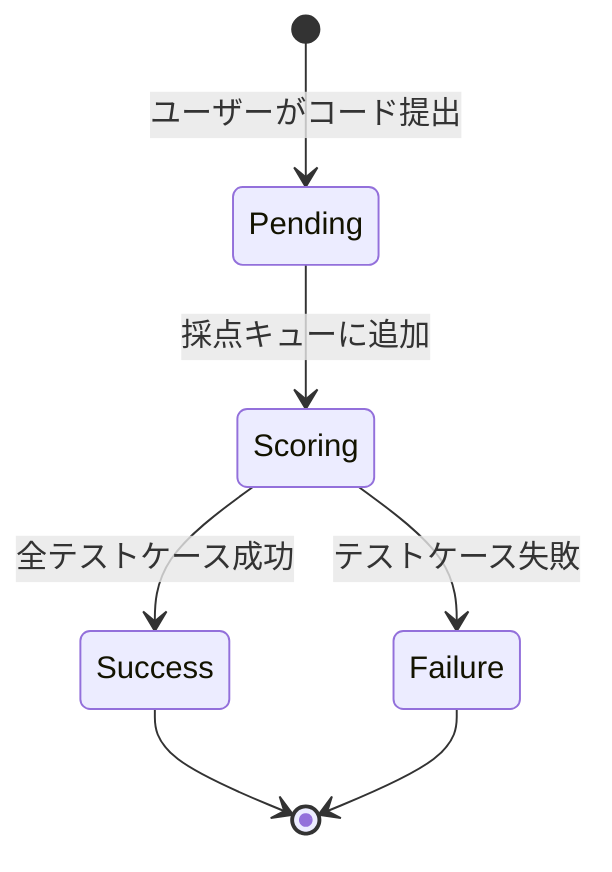

# 技術設計書

## 0. アーキテクチャ設計の原則と判断

本プラットフォームのアーキテクチャは、以下の原則に基づいて設計されています。

1.  **ステートレスとステートフルの分離**: アプリケーションロジックを持つ「ステートレス」なサービスと、データを永続化する「ステートフル」なサービスを明確に分離します。
2.  **マネージドサービスの積極活用**: データベース、キャッシュ、イベントストリームなど、専門知識を要するミドルウェアの運用は、クラウドプロバイダーが提供するマネージドサービスに任せます。これにより、開発チームは「差別化につながらない重労働(Undifferentiated Heavy Lifting)」から解放され、アプリケーションのコア機能開発に集中できます。
3.  **関心の分離**: 各マイクロサービスは、特定のビジネス機能に責任を持つように分割します。これにより、独立した開発、デプロイ、スケーリングが可能になります。

### 構成判断の根拠

| 構成要素 | 採用技術/アプローチ | 理由・根拠 |
| :--- | :--- | :--- |
| **アプリケーション実行基盤** | **Docker + Docker Compose** | 単一/少数サーバでのシンプル運用と開発生産性を重視。コンテナで責務を分離し、Compose で起動順・ネットワーク・環境変数を一元管理する。将来の拡張で k8s へ段階移行可能（非前提）。 |
| **データベース (RDB)** | **PostgreSQL（Composeで起動）／本番は外部マネージドも可** | 既定は Compose での Postgres 運用。SLA/運用要件に応じ、本番のみ RDS 等のマネージドへスイッチ可能に設計。 |
| **インメモリキャッシュ (Redis)** | **Redis（Composeで起動）／本番は外部マネージドも可** | 既定は Compose での Redis 運用。負荷/運用体制により、本番でのマネージド移行を許容。 |
| **サービス分割** | **マイクロサービスアーキテクチャ** | User, Problem, Submission, Scoringといった単位でサービスを分割。各機能が独立しているため、障害の影響範囲を限定し、チームごとの自律的な開発・デプロイを促進する。 |

## 1. システム構成

本プラットフォームは、Docker コンテナを Docker Compose で編成したサービス群として稼働する。各サービスは専用コンテナで分離され、ネットワーク/ボリューム/環境変数を Compose で宣言管理する。コードの実行は、採点要求ごとにホストの Docker デーモン上で隔離コンテナを都度起動して安全に実行する。

### 1.1. アーキテクチャ図 (Mermaid)

### 1.2. コンポーネント説明

| コンポーネント | 説明 |
| :--- | :--- |
| **ブラウザ (Next.js)** | ReactベースのNext.jsを使用し、SSR/SSG/ISRおよびRSCを活用した拡張性・保守性の高いUIを提供する。 |
| **Web (Next.js)** | フロントエンドUI。SSR/ISR/RSCの運用選択は段階導入。Compose サービスとして起動。 |
| **API (Fastify)** | 認証/権限/問題・提出のCRUD/採点要求の受付。Compose サービスとして起動。 |
| **Scoring Service** | 採点要求を受け取り、ホストのDockerに対して一時コンテナ（Scoring Runner）を起動し、結果を収集してDBへ反映。 |
| **Scoring Runner (一時コンテナ)** | 言語ランタイム/採点用ツール群を内包し、単一提出を隔離実行する短命コンテナ。完了後に削除。 |
| **PostgreSQL** | 構造化データの保存。開発/検証は Compose、運用ではマネージド移行も可。 |
| **Redis** | リプレイやキューイング等の短期データ。開発/検証は Compose、運用ではマネージド移行も可。 |
| **（任意）イベント基盤/分析** | 将来のPost-MVPで導入。現段階では必須ではない。 |

## 2. 技術スタック

| 領域 | 技術 | 理由 |
| :--- | :--- | :--- |
| **フロントエンド** | Next.js (React), TypeScript | 長期運用での人材確保/学習コスト低減、SSR/ISR/RSCなど運用選択肢の広さ、豊富なエコシステムのため。 |
| **バックエンド (API)** | Node.js, Fastify, TypeScript | 軽量で高速なWebフレームワークと型システムにより、生産性とパフォーマンスを両立するため。 |
| **データベース** | PostgreSQL, Redis | 堅牢なリレーショナルDBと、高速なインメモリDBを特性に応じて使い分けるため。 |
| **コンテナ技術** | Docker, **Docker Compose** | ローカル/本番を通じた一貫運用と起動容易性。小規模構成での低運用負荷を重視。将来のk8s移行余地は確保。 |
| **インフラ** | 単一/少数サーバ（IaaS/オンプレ） | 既定はCompose運用。本番のみデータストアにマネージド採用も可（RDS/ElastiCache等）。 |
| **イベント基盤** | Apache Kafka / AWS Kinesis | 非同期処理とデータ分析基盤への連携を実現するため。 |

### 2.1. 技術選定の過程（判断基準）

本プロジェクトの選定は、以下の基準を用いて候補技術を比較・評価した。

- 開発速度: MVP到達までの実装効率、足回りの整備コスト
- パフォーマンス: 要件の応答SLO（実行3秒平均、採点P95=15秒）を満たせるか
- セキュリティ/隔離性: コンテナ実行、権限分離、依存の健全性
- 型安全性/テスト容易性: 型システム、テスト支援、エラー処理のしやすさ
- エコシステム/採用市場: ライブラリ・プラグインの豊富さ、学習コスト、採用容易性
- 運用容易性: マネージドサービス親和性、デプロイ/監視、スケール戦略

### 2.2. フロントエンド候補比較

- Next.js (React) + TypeScript（採用）
  - 長所: 圧倒的なエコシステム、学習コストの低さ、人材確保の容易さ。App Router/Server Components/ISRなど運用選択肢が広い。Monaco/Prism等の統合事例が豊富。
  - 短所: 抽象の層が厚く、MVPではオーバーヘッドが出る場面がある。ベストプラクティスの変遷に追随が必要。

- SvelteKit + TypeScript（代替候補）
  - 長所: ランタイム軽量・高速、直感的な記法、Viteベースの高いDX。
  - 短所: React系に比べコミュニティ規模が小さく、エンジニアのローテーション時のスイッチングコストが相対的に高い。

- Nuxt (Vue) + TypeScript
  - 長所: 学習曲線が緩やか、公式モジュールが充実、SSRに強い。
  - 短所: 大規模状態管理や厳密な型運用では工夫が必要な場面あり。

- Angular
  - 長所: フルスタックなフレームワーク（ルーター/DI/フォーム）で規約が強く大規模で安定。
  - 短所: 学習コストが高め、MVPでは過剰になりやすい。

- Remix / Astro など
  - Remix: Web標準志向で美しいが、IDE的UI（エディタ/ランタイム連携）には追加設計が必要。
  - Astro: アイランズ構成に強いが、インタラクティブなアプリ本体には追加の選定が伴う。

結論（FE）: 長期運用・人員ローテーションに伴うスイッチングコスト最小化の観点から Next.js + TypeScript を採用。SvelteKitはパフォーマンス/記述性の観点で有力な代替候補とする。

### 2.3. バックエンド候補比較

- Node.js + Fastify + TypeScript（採用）
  - 長所: 高速・軽量、プラグイン設計、型による安全性。OpenAPI、認証、バリデーションの整備も容易。
  - 短所: 規約が緩く、チーム規模拡大時はアーキテクチャの明文化が必要。

- NestJS + TypeScript（代替第一候補）
  - 長所: DI/モジュール/デコレータで規約が明確。大規模開発・テスト容易性・レイヤ分離が得意。
  - 短所: ランタイム/抽象のオーバーヘッド、メタプログラミングの学習コスト。

- Express + TypeScript
  - 長所: 学習容易・資料が豊富。
  - 短所: パフォーマンス/型安全/プラグインの近代性で Fastify/Nest に劣る。

- Go (Gin/Fiber 等)
  - 長所: 高性能・低フットプリント、並行処理が容易。採点ワーカーの制御プレーンにも適性。
  - 短所: ジェネリクスやエコシステムの面で型安全なDXはTSほどではない。チームスキル前提。

- Python (FastAPI)
  - 長所: 可読性・ML連携の親和性。将来の問題自動生成などと親和。
  - 短所: スループット/同時実行で工夫が必要（非同期運用やスケール前提）。

- Rust (Axum/Actix)
  - 長所: 型安全性と最高水準の性能。採点ワーカーの高負荷用途に適性。
  - 短所: 学習コストが高く、MVPの速度は犠牲になりがち。

- Java (Spring Boot) / Elixir (Phoenix) など
  - 長所: 企業向け/リアルタイム指向など領域特化の強み。
  - 短所: チームスキル/運用前提を満たす必要あり。

結論（BE）:
- API面は「Node.js + Fastify + TypeScript」を推奨。チーム規模拡大やモノレポ管理が前提なら「NestJS」を選択肢とする。
- 採点ワーカーはポリグロットを許容: APIはNodeで維持しつつ、CPU/隔離要件が強ければワーカーをGo/Rustで実装する構成も適合。Compose 上でのマルチイメージ運用を前提とする。

### 2.4. 選定結果と却下理由（ADR要約）

- 採用: FE=Next.js(+TS), BE API=Fastify(+TS), 採点=Docker一時コンテナ（言語ランタイムは用途別イメージ）
- 却下（MVP段階）:
  - Angular/Spring Boot: 速度と過剰性の観点でMVPには重い
  - Rust全面採用: 学習コスト→納期リスクが高い
  - Python全面採用: 採点SLOとスループット達成に追加スケーリングが前提
  - サーバレス完全分割: 採点の状態管理/ジョブ実行と相性課題（検証コスト高）

影響/トレードオフ:
- 現行選定はDXと速度を優先。将来の高負荷に対しては、採点ワーカーをGo/Rustへ脱着可能とすることでリスクを低減。
- モノリス→マイクロサービスの移行は、Fastify構成でもモジュラリティを維持しておくことで段階的に対応可能。
- 運用形態は Compose を既定とし、必要時に k8s へ段階移行可能な構成（12-factor、コンテナ境界の明確化）とする。

### 2.5. フロントエンドCSS戦略の比較と選定

判断基準: 一貫性（デザインシステム適用容易性）、アクセシビリティ、保守性（命名/スコープ管理）、学習/引継ぎコスト、パフォーマンス、エコシステム。

- Tailwind CSS（採用）
  - 長所: ユーティリティ主導で命名の迷いを排除、デザイントークンを `tailwind.config` とCSS変数で集中管理、ダークモード/レスポンシブ/状態バリアントが標準化。採用実績と人材プールが大きい。
  - 短所: クラス肥大化の見通しに注意（`clsx`/`cva` 等の補助とコンポーネント分割で緩和）。

- CSS Modules + PostCSS
  - 長所: 依存軽量、既存CSS資産の取り込み容易。
  - 短所: 命名規約と設計原則（BEM等）の徹底が必要で、チームローテーション時にブレやすい。

- UIライブラリ（Chakra UI / MUI / Mantine など）
  - 長所: コンポーネント供給で開発速度が高い、アクセシビリティ配慮済み。
  - 短所: デザインの制約/カスタムコスト、バンドルサイズ。長期運用での微調整に内製知見が必要。

- Radix UI + Tailwind（推奨構成）
  - 位置づけ: 非プリミティブは極力自作しない方針。RadixのアクセシブルなプリミティブにTailwindでテーマ適用し、`cva`/`tailwind-variants`でバリアント管理。

- Styled Components / Emotion
  - 長所: コンポーネント単位のスタイルカプセル化。
  - 短所: ランタイムコスト、型補完/テーマ運用に追加設計が必要。Next.js RSCとの相性考慮が必要。

選定結果（CSS）: Tailwind CSS を採用。アクセシビリティ確保とコアUIの再利用性向上のため Radix UI を併用。デザイントークンはCSS変数 + Tailwindテーマで集中管理し、クラス構築には `clsx` と `class-variance-authority`（または `tailwind-variants`）を用いる。

## 3. データベース設計

### 3.1. ER図 (Mermaid)

### 3.2. テーブル定義一覧

| 物理名 | 論理名 | 概要 |
| :--- | :--- | :--- |
| `USERS` | ユーザー | システムを利用する全てのユーザー（受験者、採用担当者など）の情報を格納する。 |
| `PROBLEMS` | 問題 | コーディングテストの問題文、難易度、カテゴリなどの情報を格納する。 |
| `TEST_CASES` | テストケース | 各問題に紐づくテストケース（入力、期待出力）を格納する。 |
| `LANGUAGES` | 対応言語 | システムが採点に対応しているプログラミング言語とバージョンを格納する。 |
| `ASSESSMENTS` | アセスメント | 複数の問題を束ねた評価セット（試験全体）の情報を格納する。 |
| `ASSESSMENT_PROBLEMS` | アセスメント問題関連 | アセスメントと問題の多対多の関連を定義する中間テーブル。 |
| `CANDIDATE_ASSESSMENTS` | 受験者アセスメント | どの受験者がどのアセスメントを受験するかを管理する。 |
| `SUBMISSIONS` | 提出コード | 受験者が提出したコード、ステータス、採点結果を格納する。 |
| `SKILL_MAPS` | スキルマップ | エンジニア育成用のスキルマップ（例: フロントエンドロードマップ）を定義する。 |
| `SKILL_NODES` | スキルノード | スキルマップを構成する個々のスキル項目（例: CSS, React）を定義する。 |
| `PROBLEM_SKILL_NODES` | 問題スキルノード関連 | 問題とスキルノードの多対多の関連を定義する中間テーブル。 |

### 3.3. 詳細テーブル定義

#### **USERS (ユーザー)**
システムを利用する全てのユーザー情報を格納する。

| No | 物理名 | 論理名 | データ型 | 制約 | 用途 |
| :-- | :--- | :--- | :--- | :--- | :--- |
| 1 | `id` | ユーザーID | SERIAL | PK | ユーザーを一意に識別する主キー |
| 2 | `name` | 氏名 | VARCHAR(255) | NOT NULL | ユーザーの氏名 |
| 3 | `email` | メールアドレス | VARCHAR(255) | NOT NULL, UNIQUE | ログインに使用するメールアドレス |
| 4 | `password_hash` | パスワードハッシュ | VARCHAR(255) | NOT NULL | ハッシュ化されたパスワード |
| 5 | `role` | 役割 | VARCHAR(50) | NOT NULL | ユーザーの役割 (Candidate, Recruiter, Adminなど) |
| 6 | `created_at` | 作成日時 | TIMESTAMP | NOT NULL | レコード作成日時 |
| 7 | `updated_at` | 更新日時 | TIMESTAMP | NOT NULL | レコード更新日時 |

#### **PROBLEMS (問題)**
コーディングテストの問題に関する情報を格納する。

| No | 物理名 | 論理名 | データ型 | 制約 | 用途 |
| :-- | :--- | :--- | :--- | :--- | :--- |
| 1 | `id` | 問題ID | SERIAL | PK | 問題を一意に識別する主キー |
| 2 | `title` | 問題タイトル | VARCHAR(255) | NOT NULL | 問題のタイトル |
| 3 | `description` | 問題文 | TEXT | NOT NULL | Markdown形式の問題文 |
| 4 | `difficulty` | 難易度 | VARCHAR(50) | NOT NULL | 問題の難易度 (Easy, Medium, Hard) |
| 5 | `category` | カテゴリ | VARCHAR(100) | | 問題のカテゴリ (例: アルゴリズム, データ構造) |
| 6 | `author_id` | 作成者ID | INTEGER | FK (USERS) | 問題を作成したユーザーのID |
| 7 | `created_at` | 作成日時 | TIMESTAMP | NOT NULL | レコード作成日時 |
| 8 | `updated_at` | 更新日時 | TIMESTAMP | NOT NULL | レコード更新日時 |
| 9 | `estimated_time_minutes` | 想定解答時間(分) | INTEGER | | 問題を解くのにかかると想定される時間（5分単位） |

#### **TEST_CASES (テストケース)**
各問題に紐づくテストケースを格納する。

| No | 物理名 | 論理名 | データ型 | 制約 | 用途 |
| :-- | :--- | :--- | :--- | :--- | :--- |
| 1 | `id` | テストケースID | SERIAL | PK | テストケースを一意に識別する主キー |
| 2 | `problem_id` | 問題ID | INTEGER | NOT NULL, FK (PROBLEMS) | 紐づく問題のID |
| 3 | `name` | テストケース名 | VARCHAR(255) | | テストケースの名称（例: 基本ケース, エッジケース） |
| 4 | `input` | 入力値 | TEXT | | コードに渡される標準入力値 |
| 5 | `expected_output` | 期待する出力 | TEXT | | コードが標準出力すべき期待値 |
| 6 | `is_hidden` | 非公開フラグ | BOOLEAN | NOT NULL, DEFAULT FALSE | 受験者にテストケースの内容を公開するかどうか |
| 7 | `weight` | 重み | FLOAT | NOT NULL, DEFAULT 1.0 | 採点時の配点ウェイト |

#### **LANGUAGES (対応言語)**
システムが対応するプログラミング言語を格納する。

| No | 物理名 | 論理名 | データ型 | 制約 | 用途 |
| :-- | :--- | :--- | :--- | :--- | :--- |
| 1 | `id` | 言語ID | SERIAL | PK | 言語を一意に識別する主キー |
| 2 | `name` | 言語名 | VARCHAR(100) | NOT NULL | プログラミング言語名 (例: Python, JavaScript) |
| 3 | `version` | バージョン | VARCHAR(50) | NOT NULL | 言語のバージョン (例: 3.9, 18.x) |
| 4 | `docker_image` | Dockerイメージ | VARCHAR(255) | NOT NULL | 採点に使用するDockerイメージ名 |

#### **ASSESSMENTS (アセスメント)**
複数の問題を束ねた評価セット（試験）を定義する。

| No | 物理名 | 論理名 | データ型 | 制約 | 用途 |
| :-- | :--- | :--- | :--- | :--- | :--- |
| 1 | `id` | アセスメントID | SERIAL | PK | アセスメントを一意に識別する主キー |
| 2 | `title` | タイトル | VARCHAR(255) | NOT NULL | アセスメントの名称 |
| 3 | `description` | 説明 | TEXT | | アセスメントの詳細な説明 |
| 4 | `time_limit_minutes` | 制限時間(分) | INTEGER | | アセスメント全体の制限時間（分単位） |
| 5 | `created_by` | 作成者ID | INTEGER | NOT NULL, FK (USERS) | アセスメントを作成したユーザーのID |
| 6 | `created_at` | 作成日時 | TIMESTAMP | NOT NULL | レコード作成日時 |
| 7 | `updated_at` | 更新日時 | TIMESTAMP | NOT NULL | レコード更新日時 |
| 8 | `pre_assessment_guide` | 開始前案内文 | TEXT | | 受験開始前に表示される注意事項など |
| 9 | `post_assessment_guide` | 終了後案内文 | TEXT | | 受験完了後に表示されるメッセージなど |

#### **ASSESSMENT_PROBLEMS (アセスメント問題関連)**
アセスメントと問題の多対多の関連を定義する。

| No | 物理名 | 論理名 | データ型 | 制約 | 用途 |
| :-- | :--- | :--- | :--- | :--- | :--- |
| 1 | `assessment_id` | アセスメントID | INTEGER | PK, FK (ASSESSMENTS) | 関連するアセスメントのID |
| 2 | `problem_id` | 問題ID | INTEGER | PK, FK (PROBLEMS) | 関連する問題のID |
| 3 | `order` | 表示順 | INTEGER | NOT NULL | アセスメント内での問題の表示順序 |

#### **CANDIDATE_ASSESSMENTS (受験者アセスメント)**
どの受験者がどのアセスメントを受験するかを管理する。

| No | 物理名 | 論理名 | データ型 | 制約 | 用途 |
| :-- | :--- | :--- | :--- | :--- | :--- |
| 1 | `id` | 受験アセスメントID | SERIAL | PK | 受験を一意に識別する主キー |
| 2 | `assessment_id` | アセスメントID | INTEGER | NOT NULL, FK (ASSESSMENTS) | 受験するアセスメントのID |
| 3 | `candidate_id` | 受験者ID | INTEGER | NOT NULL, FK (USERS) | 受験するユーザーのID |
| 4 | `status` | ステータス | VARCHAR(50) | NOT NULL | 受験の進捗 (Pending, InProgress, Completed, Expired) |
| 5 | `due_date` | 受験期限 | TIMESTAMP | | この日時を過ぎると受験不可となる |
| 6 | `completed_at` | 完了日時 | TIMESTAMP | | 受験者がアセスメントを完了した日時 |
| 7 | `overall_score` | 総合スコア | FLOAT | | アセスメント全体のスコア |

#### **SUBMISSIONS (提出コード)**
受験者が提出したコードと採点結果を格納する。

| No | 物理名 | 論理名 | データ型 | 制約 | 用途 |
| :-- | :--- | :--- | :--- | :--- | :--- |
| 1 | `id` | 提出ID | SERIAL | PK | 提出を一意に識別する主キー |
| 2 | `candidate_assessment_id` | 受験アセスメントID | INTEGER | NOT NULL, FK (CANDIDATE_ASSESSMENTS) | どの受験アセスメントに対する提出かを示すID |
| 3 | `problem_id` | 問題ID | INTEGER | NOT NULL, FK (PROBLEMS) | 提出対象の問題ID |
| 4 | `language_id` | 言語ID | INTEGER | NOT NULL, FK (LANGUAGES) | 提出に使用された言語のID |
| 5 | `code` | コード | TEXT | NOT NULL | 提出されたソースコード |
| 6 | `status` | ステータス | VARCHAR(50) | NOT NULL | 採点ステータス (Pending, Scoring, Success, Failure) |
| 7 | `score` | スコア | FLOAT | | この提出に対するスコア |
| 8 | `submitted_at` | 提出日時 | TIMESTAMP | NOT NULL | コードが提出された日時 |

#### **SKILL_MAPS (スキルマップ)**
エンジニア育成用のスキルマップ（ロードマップ）を定義する。

| No | 物理名 | 論理名 | データ型 | 制約 | 用途 |
| :-- | :--- | :--- | :--- | :--- | :--- |
| 1 | `id` | スキルマップID | SERIAL | PK | スキルマップを一意に識別する主キー |
| 2 | `name` | 名称 | VARCHAR(255) | NOT NULL | スキルマップの名称（例: バックエンドエンジニア v1） |
| 3 | `description` | 説明 | TEXT | | スキルマップの詳細な説明 |

#### **SKILL_NODES (スキルノード)**
スキルマップを構成する個々のスキル項目を定義する。

| No | 物理名 | 論理名 | データ型 | 制約 | 用途 |
| :-- | :--- | :--- | :--- | :--- | :--- |
| 1 | `id` | スキルノードID | SERIAL | PK | スキルノードを一意に識別する主キー |
| 2 | `skill_map_id` | スキルマップID | INTEGER | NOT NULL, FK (SKILL_MAPS) | 所属するスキルマップのID |
| 3 | `name` | 名称 | VARCHAR(255) | NOT NULL | スキルノードの名称（例: REST API, GraphQL） |
| 4 | `description` | 説明 | TEXT | | スキルノードの詳細な説明 |
| 5 | `parent_node_id` | 親ノードID | INTEGER | FK (SKILL_NODES) | 親ノードID。ツリー構造を表現する自己参照キー |

#### **PROBLEM_SKILL_NODES (問題スキルノード関連)**
問題とスキルノードの多対多の関連を定義する。

| No | 物理名 | 論理名 | データ型 | 制約 | 用途 |
| :-- | :--- | :--- | :--- | :--- | :--- |
| 1 | `problem_id` | 問題ID | INTEGER | PK, FK (PROBLEMS) | 関連する問題のID |
| 2 | `skill_node_id` | スキルノードID | INTEGER | PK, FK (SKILL_NODES) | 関連するスキルノードのID |

### 3.4. データステータス遷移図

#### `CANDIDATE_ASSESSMENTS` (受験アセスメント)

#### `SUBMISSIONS` (コード提出)

## 4. 画面設計

### 4.1. 画面一覧

1.  **問題作成/編集画面**:
    *   問題のタイトル、説明（Markdown）、難易度、カテゴリなどを入力。
    *   テストケース（入力、期待される出力）を複数設定。
    *   言語ごとのコードテンプレートを登録。
    *   **想定解答時間を5分単位で設定するための入力フィールド（ドロップダウン等）を追加。**

2.  **アセスメント作成/編集画面**:
    *   アセスメント名、説明、制限時間を設定。
    *   登録済みの問題ライブラリから問題を選択して追加。
    *   ドラッグ＆ドロップで問題の順序を変更。
    *   **開始前案内文と終了後案内文を編集するためのMarkdownエディタを追加。**

3.  **アセスメント割当画面**:
    *   受験者（候補者）を選択。
    *   作成済みのアセスメントを選択。
    *   受験期限を設定し、招待メールを送信。

4.  **受験者ダッシュボード画面**:
    *   自分に割り当てられたアセスメントの一覧を表示（ステータス：未着手、進行中、完了）。
    *   「テストを開始」ボタンで受験画面へ遷移。

5.  **テスト受験画面**:
    *   **左ペイン**: アセスメント内の問題一覧（例: "問題 1", "問題 2"）と、選択中の問題文。
    *   **中央ペイン**: コードエディタ。言語選択ドロップダウン。
    *   **右ペイン**: カスタム入力、実行結果、「実行」「提出」ボタン。

6.  **結果確認画面**:
    *   採用担当者/面接官向け。
    *   受験者ごとのアセスメント一覧と総合スコアを表示。
    *   アセスメントを選択すると、問題ごとのスコア、提出コード、実行結果の詳細を閲覧可能。

### 4.2. UIデザインシステム（トークン）

目的: UIの一貫性・可読性・アクセシビリティを担保し、エンジニアのローテーション時でもルールに沿って素早く拡張できるよう、デザイントークンを定義する。Tailwind CSS のテーマはこれらのトークンを参照して設定する。

方針:
- トークンはCSS変数で定義し、`[data-theme="light"]` / `[data-theme="dark"]` で切替。
- Tailwindはトークン参照を前提にテーマを拡張（色・間隔・半径・影など）。
- コンポーネントの状態バリアントは `class-variance-authority`（または `tailwind-variants`）で管理。
- アクセシビリティ: コントラスト比は原則 4.5:1 以上を満たす色組合せを採用。

コアトークン（抽象）
- 色（抽象）
  - `--color-primary`, `--color-accent`, `--color-success`, `--color-warning`, `--color-danger`
  - グレースケール: `--gray-0`(背景最明) ～ `--gray-950`(最暗)
- タイポグラフィ
  - フォント: `--font-sans`, `--font-mono`
  - サイズ: `--font-size-xs(12)`, `--sm(14)`, `--base(16)`, `--lg(18)`, `--xl(20)`, `--2xl(24)`, `--3xl(30)`
  - 行間: `--leading-tight(1.25)`, `--normal(1.5)`, `--relaxed(1.7)`
  - 太さ: `--weight-regular(400)`, `--medium(500)`, `--semibold(600)`, `--bold(700)`
- スペーシング（4pxベース）
  - `--space-0(0)`, `--1(4)`, `--2(8)`, `--3(12)`, `--4(16)`, `--6(24)`, `--8(32)`, `--10(40)`, `--12(48)`
- 角丸
  - `--radius-sm(4)`, `--md(8)`, `--lg(12)`, `--xl(16)`, `--full(9999)`
- エレベーション/影
  - `--shadow-1`, `--shadow-2`, `--shadow-3`, `--shadow-4`（段階的に強く）
- 枠線/フォーカス
  - `--border-color`, `--border-width-1(1px)`, `--border-width-2(2px)`
  - `--focus-ring-color`, `--focus-ring-offset(2px)`, `--focus-ring-width(2px)`
- モーション
  - 時間: `--duration-100(100ms)`, `--150`, `--200`, `--300`
  - イージング: `--ease-standard(cubic-bezier(0.2,0,0,1))`, `--ease-emphasized(0.2,0,0,1)`
- レイヤリング
  - `--z-dropdown(1000)`, `--z-modal(1100)`, `--z-toast(1200)`, `--z-overlay(1300)`

セマンティックトークン（用途）
- 背景/面/境界
  - `--bg`, `--surface`, `--surface-muted`, `--surface-elevated`, `--border`
- テキスト
  - `--text`, `--text-muted`, `--text-inverse`
- アクション
  - `--primary`, `--on-primary`（コントラストテキスト）
  - `--accent`, `--on-accent`
  - `--success`, `--on-success`; `--warning`, `--on-warning`; `--danger`, `--on-danger`

ライト/ダーク値（推奨カラーパレット例）
- ライトテーマ（例）
  - `--bg: #ffffff`, `--surface: #f8fafc`, `--surface-muted: #f1f5f9`, `--border: #e2e8f0`
  - `--text: #0f172a`, `--text-muted: #475569`
  - `--primary: #2563eb`, `--on-primary: #ffffff`
  - `--accent: #7c3aed`, `--on-accent: #ffffff`
  - `--success: #16a34a`, `--warning: #f59e0b`, `--danger: #dc2626`
- ダークテーマ（例）
  - `--bg: #0b1220`, `--surface: #0f172a`, `--surface-muted: #111827`, `--border: #1f2937`
  - `--text: #e5e7eb`, `--text-muted: #94a3b8`
  - `--primary: #3b82f6`, `--on-primary: #0b1220`
  - `--accent: #a78bfa`, `--on-accent: #0b1220`
  - `--success: #22c55e`, `--warning: #fbbf24`, `--danger: #ef4444`

適用指針
- コンポーネントは「セマンティックトークン」のみを参照し、原色値や抽象トークンを直接参照しない。
- Tailwindのユーティリティは、テーマ拡張でCSS変数を解決する形を基本とする。
- フォーカス・ホバー・無効などの状態は、デザイントークンで色/影/境界を規定した上で `data-state` 属性またはARIA属性に応じてスタイルを適用する。
- コンポーネントプリミティブ（ボタン、入力、カード、ダイアログなど）は Radix UI を土台に構築し、トークンで外観を統一する。

### 4.3. トンマナ選定と適用範囲（採用方針）

採用するトンマナ: A. Trust & Focus を基調に、学習系ダッシュボード/ゲーミフィケーション箇所のみ B. Energetic Learning のアクセント（lime/cyan）を限定併用するハイブリッド。

採用カラートークン（ライト/ダーク）
- Primary（主要動線/CTA）
  - light: `--primary: #2563eb`（blue-600）, `--on-primary: #ffffff`
  - dark: `--primary: #3b82f6`（blue-500）, `--on-primary: #0b1220`
- Secondary Accent（一般アクセント/タグ/リンク強調）
  - light: `--accent: #7c3aed`（violet-600）, `--on-accent: #ffffff`
  - dark: `--accent: #a78bfa`（violet-300）, `--on-accent: #0b1220`
- Energetic Accents（学習/実績/進捗の限定用途）
  - lime: `--accent-lime: #84cc16`（light）, `--accent-lime-dark: #a3e635`（dark）, `--on-accent-lime: #0b1220`
  - cyan: `--accent-cyan: #06b6d4`（light）, `--accent-cyan-dark: #22d3ee`（dark）, `--on-accent-cyan: #0b1220`

Tailwindテーマへのマッピング（例）
- `colors.primary.DEFAULT = var(--primary)` / `colors.primary.foreground = var(--on-primary)`
- `colors.accent.DEFAULT = var(--accent)` / `colors.accent.foreground = var(--on-accent)`
- `colors.accentLime.DEFAULT = var(--accent-lime)` / `colors.accentLime.dark = var(--accent-lime-dark)`
- `colors.accentCyan.DEFAULT = var(--accent-cyan)` / `colors.accentCyan.dark = var(--accent-cyan-dark)`

適用ルール（重要）
- Energetic（lime/cyan）は「学習ダッシュボード/ゲーミフィケーション」に限定。
  - 主な適用先: バッジ/アチーブメント、進捗バー、ハイライトされたメトリクス、グラフの強調系列。
  - 禁止: 主要CTA/危険操作/フォーム主要要素での使用。Primaryと競合させない。
  - 1画面あたり同時使用は1系統まで（lime または cyan どちらか）。使用面積の目安は画面の10%以内。
- Secondary（violet）は一般アクセント（タグ/リンク/二次ボタン）に使用。Primaryの代替にはしない。
- コントラスト比はテキストで4.5:1以上、アイコン/ボタン前景で3:1以上を満たす。
- 状態表現は色に依存せず、アイコン/ラベル/フォーカスリングで冗長化する。

コンポーネント意図マップ（推奨）
- Button: `intent=primary|secondary|neutral|success|warning|danger`
  - primary=Primary、secondary=Secondary、neutral=グレー系、success/warning/danger=各セマンティック色
  - 学習系の達成/進捗UIはボタンではなくBadge/Tag/Progressでlime/cyanを使用
- Progress/Badge/Tag（学習/実績）: lime/cyan を用途に応じて選択（重複使用は避ける）
- Chart: 強調系列のみ lime/cyan、基調はグレー/Primary系で可視コントラストを確保

レビュー・検証チェックリスト
- 主要画面での色使用率（Primary:Accent:Neutral）が 1:1:8 付近に収まっているか
- CTAが常にPrimaryで一意に見分けられるか
- アクセントの乱用がないか（1画面でのlime/cyan同時使用禁止）
- コントラストとフォーカスリングがWCAG基準を満たすか

## 5. API仕様

### 5.1. アセスメント関連API

| Method | Endpoint | 説明 |
| :--- | :--- | :--- |
| `POST` | `/api/v1/assessments` | 新規アセスメント作成 |
| `GET` | `/api/v1/assessments/:id` | アセスメント詳細取得 |
| `POST` | `/api/v1/candidate-assessments` | 受験者にアセスメントを割当 |
| `GET` | `/api/v1/candidate-assessments/me`| 受験者が自身のアセスメント一覧を取得 |

### 5.2. コード実行・提出API

| Method | Endpoint | 説明 |
| :--- | :--- | :--- |
| `POST` | `/api/v1/execute` | コードを任意の入力で実行し、結果を返す（採点なし）。 |
| `POST` | `/api/v1/submissions` | Request Bodyに `candidate_assessment_id` を含めてコードを提出し、採点を要求する。 |

## 6. 将来の拡張性

### 6.1. AIによる問題自動生成
本プラットフォームの競争力を高めるため、将来的には大規模言語モデル（LLM）API（例: Gemini API）と連携し、問題の自動生成機能の実装を検討する。

-   **アーキテクチャ**:
    -   `Problem Service` から、外部のLLM APIを呼び出すための新しいマイクロサービス `AI Problem Generator Service` を追加する。
    -   生成された問題の品質を担保するため、人間によるレビューと修正を行うワークフローを設ける。
-   **プロンプトエンジニアリング**:
    -   指定された難易度と観点から、高品質な問題を生成するためのプロンプトテンプレートを設計・管理する。

### 6.2. 受験者パフォーマンスの時系列分析
-   **データモデル**:
    -   分析クエリのパフォーマンスを向上させるため、定期的に `CANDIDATE_ASSESSMENTS` と `SUBMISSIONS` テーブルからデータを集計し、受験者ごとのパフォーマンスサマリーテーブル（例: `CANDIDATE_PERFORMANCE_SUMMARY`）を作成することを検討する。
-   **画面設計**:
    -   **受験者詳細ページ**に「パフォーマンス分析」タブを追加する。
    -   このタブ内には、スコア推移を示す折れ線グラフや、カテゴリごとの正答率を示すレーダーチャートなどを配置する。

### 6.3. スキルマップ連携によるエンジニア育成支援
-   **アーキテクチャ**:
    -   アセスメントの採点が完了した際にイベントを発行し、非同期でスキル習熟度を更新するサービスを検討する。
-   **画面設計**:
    -   **スキルマップダッシュボード**:
        -   `roadmap.sh`のように、インタラクティブにズームやパンが可能なスキルツリーとして描画する。
        -   各ノードは習熟度に応じて色分けされ（例: 未着手、学習中、習得済み）、クリックすると詳細や関連問題が表示される。
- 付録/詳細ガイド
- フロントエンドの具体的な運用ガイド（Tailwind テーマ設計、cva のバリアント設計、主要コンポーネント要件など）は docs/frontend_style_guide.md を参照。

## 7. 品質保証・テスト戦略

### 7.1 テストピラミッドと責務
- 単体（ベース）: ドメインロジック、ユーティリティ、UIコンポーネントの振る舞い。高速で網羅性を担保。
- 結合/統合（中段）: APIハンドラ〜DB/Redis の相互作用（testcontainers 等）。契約とエラーハンドリングを検証。
- 受入/E2E（上段）: ユーザーストーリーの主要フローを最小本数で確認。過度なE2Eの乱用は避ける。

### 7.2 TDD 運用
- 原則 TDD（RED→GREEN→REFACTOR）を採用。
- 仕様追加・変更時は、先に失敗するテスト（RED）を作成し、最小実装でGREEN、続いて設計の整合・重複排除のREFACTOR。
- カバレッジは 80% を目標（品質重視、数値至上主義は避ける）。

### 7.3 CI 連携
- PR 作成時に lint/typecheck/unit/build を必須。integration は内部PRのみ、E2E は `run-e2e` ラベル時に実行。
- 詳細は `docs/pr_auto_checks.md` を参照。
