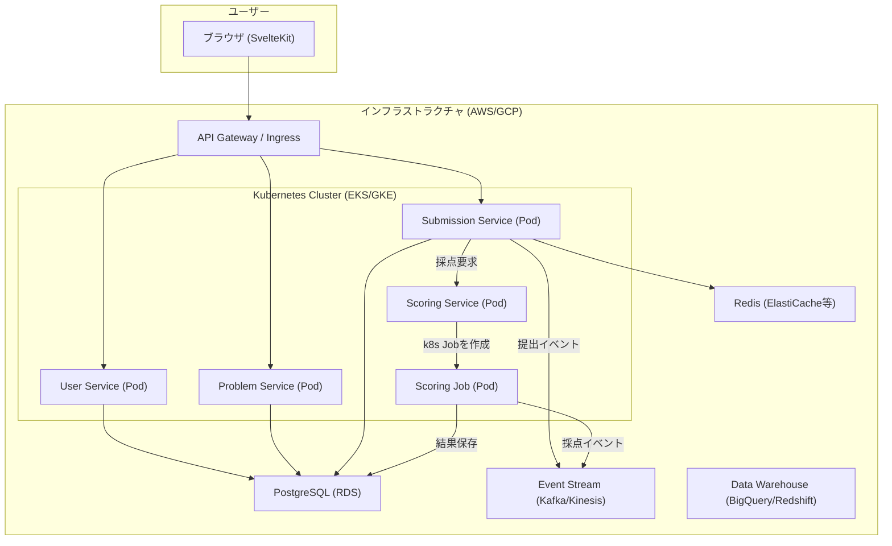
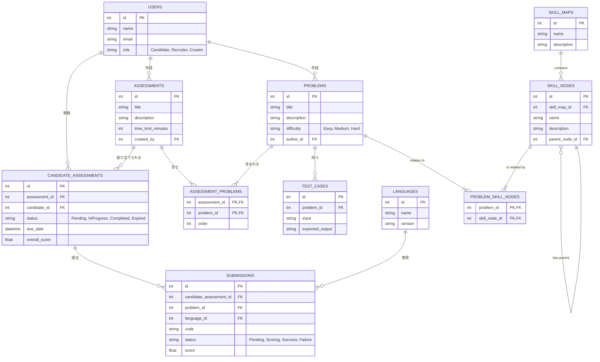
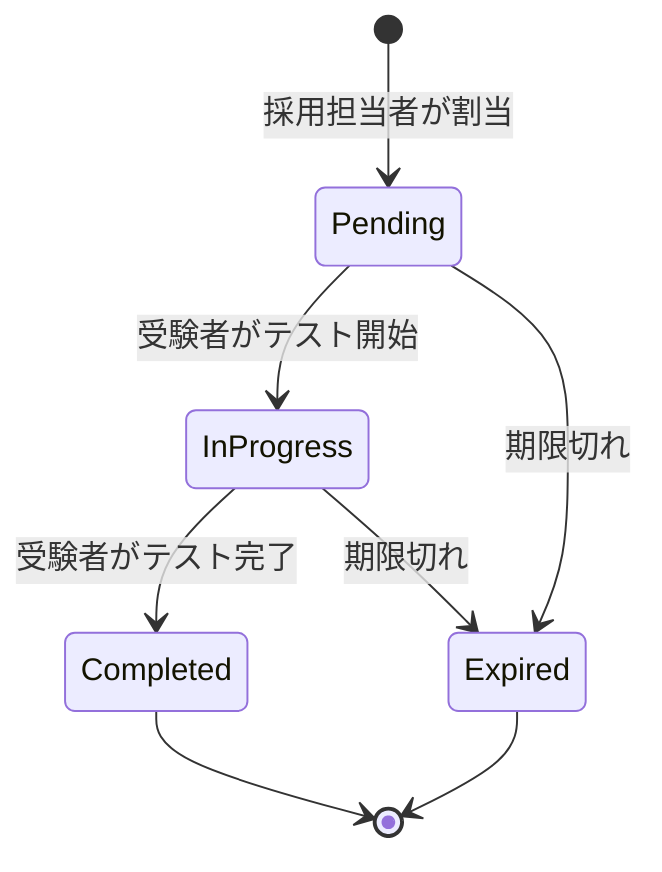
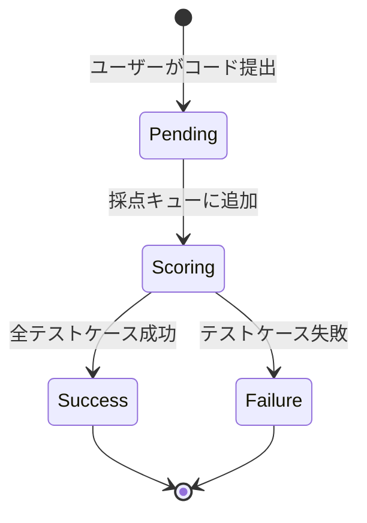

# 技術設計書

## 0. アーキテクチャ設計の原則と判断

本プラットフォームのアーキテクチャは、以下の原則に基づいて設計されています。

1.  **ステートレスとステートフルの分離**: アプリケーションロジックを持つ「ステートレス」なサービスと、データを永続化する「ステートフル」なサービスを明確に分離します。
2.  **マネージドサービスの積極活用**: データベース、キャッシュ、イベントストリームなど、専門知識を要するミドルウェアの運用は、クラウドプロバイダーが提供するマネージドサービスに任せます。これにより、開発チームは「差別化につながらない重労働(Undifferentiated Heavy Lifting)」から解放され、アプリケーションのコア機能開発に集中できます。
3.  **関心の分離**: 各マイクロサービスは、特定のビジネス機能に責任を持つように分割します。これにより、独立した開発、デプロイ、スケーリングが可能になります。

### 構成判断の根拠

| 構成要素 | 採用技術/アプローチ | 理由・根拠 |
| :--- | :--- | :--- |
| **アプリケーション実行基盤** | **Kubernetes (k8s)** | コンテナ化されたマイクロサービスのデプロイ、スケーリング、自己修復を自動化するため。特定のクラウドに依存しないポータビリティも確保できる。 |
| **データベース (RDB)** | **外部マネージドサービス (AWS RDS等)** | **データの安全性と運用負荷軽減のため。** バックアップ、パッチ適用、高可用性構成といった複雑なDB運用を専門のサービスに委任することで、堅牢性を高め、開発者の負担を大幅に削減する。 |
| **インメモリキャッシュ (Redis)** | **外部マネージドサービス (AWS ElastiCache等)** | **RDBと同様、ステートフルなコンポーネントであるため。** Kubernetesクラスタはステートレスなアプリの実行環境と割り切り、ライフサイクルが異なるデータストアはクラスタ外で管理するのが安全かつ効率的です。k8s内でStatefulSetを用いて構築することも可能ですが、マネージドサービスを利用する方が、特に小規模なチームにおいては運用負荷とリスクの観点からメリットが大きいと判断しました。 |
| **サービス分割** | **マイクロサービスアーキテクチャ** | User, Problem, Submission, Scoringといった単位でサービスを分割。各機能が独立しているため、障害の影響範囲を限定し、チームごとの自律的な開発・デプロイを促進する。 |

## 1. システム構成

本プラットフォームは、Kubernetes上で動作するマイクロサービスアーキテクチャを採用する。各サービスはコンテナ化され、スケーラビリティと可用性を確保する。コードの実行は、採点要求ごとに動的に生成される隔離されたPod内で安全に実行される。

### 1.1. アーキテクチャ図 (Mermaid)

### 1.2. コンポーネント説明

| コンポーネント | 説明 |
| :--- | :--- |
| **ブラウザ (SvelteKit)** | 軽量なフレームワークSvelteKitを使用し、リアクティブで高速なUIを提供する。 |
| **API Gateway / Ingress** | 全てのリクエストの窓口。認証、ルーティング、レートリミット等を担当。KubernetesのIngress Controllerと連携する。 |
| **User Service** | ユーザー情報の管理、認証、権限管理を行う。k8s上のPodとしてデプロイされる。 |
| **Problem Service** | コーディング問題、テストケース、カテゴリ、難易度の管理を行う。k8s上のPodとしてデプロイされる。 |
| **Submission Service** | 候補者からのコード提出を受け付け、DBに保存。リプレイデータはRedisに記録する。k8s上のPodとしてデプロイされる。 |
| **Scoring Service** | 提出されたコードの採点要求を管理する。要求ごとに、隔離された**Kubernetes Job**を生成し、その中でサンドボックス化されたPodがコードを実行・採点する。 |
| **Scoring Job (Pod)** | `Scoring Service`によって動的に作成される一時的なPod。特定の提出コードを安全な環境で実行し、結果を返す責務を持つ。 |
| **Kubernetes Cluster** | EKS (AWS), GKE (GCP) などのマネージドk8sサービス。各マイクロサービスのコンテナをPodとして実行し、デプロイ、スケーリング、監視を自動化する。 |
| **PostgreSQL (RDS)** | ユーザー、問題、提出結果などの構造化データを格納するプライマリデータベース。 |
| **Redis (ElastiCache等)** | コーディングのリプレイデータなど、高速な読み書きが必要な時系列データを格納する。マネージドサービスの利用を推奨。 |
| **Event Stream** | ユーザー操作や採点結果などのイベントを収集し、データ分析基盤へ連携する。 |
| **Data Warehouse** | 集約されたイベントデータを格納し、分析クエリを実行するための基盤。 |

## 2. 技術スタック

| 領域 | 技術 | 理由 |
| :--- | :--- | :--- |
| **フロントエンド** | SvelteKit, TypeScript | 高速な動作と、コンパイル時の型チェックによる堅牢性を両立するため。 |
| **バックエンド (API)** | Node.js, Fastify, TypeScript | 軽量で高速なWebフレームワークと型システムにより、生産性とパフォーマンスを両立するため。 |
| **データベース** | PostgreSQL, Redis | 堅牢なリレーショナルDBと、高速なインメモリDBを特性に応じて使い分けるため。 |
| **コンテナ技術** | Docker, **Kubernetes** | セキュアなコード実行環境と、宣言的なデプロイ、自己修復、水平スケーリングを実現するため。 |
| **インフラ** | AWS / GCP | マネージドサービス（EKS, RDS, ElastiCache等）を活用し、運用負荷を軽減するため。 |
| **イベント基盤** | Apache Kafka / AWS Kinesis | 非同期処理とデータ分析基盤への連携を実現するため。 |

## 3. データベース設計

### 3.1. ER図 (Mermaid)

### 3.2. テーブル定義一覧

| 物理名 | 論理名 | 概要 |
| :--- | :--- | :--- |
| `USERS` | ユーザー | システムを利用する全てのユーザー（受験者、採用担当者など）の情報を格納する。 |
| `PROBLEMS` | 問題 | コーディングテストの問題文、難易度、カテゴリなどの情報を格納する。 |
| `TEST_CASES` | テストケース | 各問題に紐づくテストケース（入力、期待出力）を格納する。 |
| `LANGUAGES` | 対応言語 | システムが採点に対応しているプログラミング言語とバージョンを格納する。 |
| `ASSESSMENTS` | アセスメント | 複数の問題を束ねた評価セット（試験全体）の情報を格納する。 |
| `ASSESSMENT_PROBLEMS` | アセスメント問題関連 | アセスメントと問題の多対多の関連を定義する中間テーブル。 |
| `CANDIDATE_ASSESSMENTS` | 受験者アセスメント | どの受験者がどのアセスメントを受験するかを管理する。 |
| `SUBMISSIONS` | 提出コード | 受験者が提出したコード、ステータス、採点結果を格納する。 |
| `SKILL_MAPS` | スキルマップ | エンジニア育成用のスキルマップ（例: フロントエンドロードマップ）を定義する。 |
| `SKILL_NODES` | スキルノード | スキルマップを構成する個々のスキル項目（例: CSS, React）を定義する。 |
| `PROBLEM_SKILL_NODES` | 問題スキルノード関連 | 問題とスキルノードの多対多の関連を定義する中間テーブル。 |

### 3.3. 詳細テーブル定義

#### **USERS (ユーザー)**
システムを利用する全てのユーザー情報を格納する。

| No | 物理名 | 論理名 | データ型 | 制約 | 用途 |
| :-- | :--- | :--- | :--- | :--- | :--- |
| 1 | `id` | ユーザーID | SERIAL | PK | ユーザーを一意に識別する主キー |
| 2 | `name` | 氏名 | VARCHAR(255) | NOT NULL | ユーザーの氏名 |
| 3 | `email` | メールアドレス | VARCHAR(255) | NOT NULL, UNIQUE | ログインに使用するメールアドレス |
| 4 | `password_hash` | パスワードハッシュ | VARCHAR(255) | NOT NULL | ハッシュ化されたパスワード |
| 5 | `role` | 役割 | VARCHAR(50) | NOT NULL | ユーザーの役割 (Candidate, Recruiter, Adminなど) |
| 6 | `created_at` | 作成日時 | TIMESTAMP | NOT NULL | レコード作成日時 |
| 7 | `updated_at` | 更新日時 | TIMESTAMP | NOT NULL | レコード更新日時 |

#### **PROBLEMS (問題)**
コーディングテストの問題に関する情報を格納する。

| No | 物理名 | 論理名 | データ型 | 制約 | 用途 |
| :-- | :--- | :--- | :--- | :--- | :--- |
| 1 | `id` | 問題ID | SERIAL | PK | 問題を一意に識別する主キー |
| 2 | `title` | 問題タイトル | VARCHAR(255) | NOT NULL | 問題のタイトル |
| 3 | `description` | 問題文 | TEXT | NOT NULL | Markdown形式の問題文 |
| 4 | `difficulty` | 難易度 | VARCHAR(50) | NOT NULL | 問題の難易度 (Easy, Medium, Hard) |
| 5 | `category` | カテゴリ | VARCHAR(100) | | 問題のカテゴリ (例: アルゴリズム, データ構造) |
| 6 | `author_id` | 作成者ID | INTEGER | FK (USERS) | 問題を作成したユーザーのID |
| 7 | `created_at` | 作成日時 | TIMESTAMP | NOT NULL | レコード作成日時 |
| 8 | `updated_at` | 更新日時 | TIMESTAMP | NOT NULL | レコード更新日時 |
| 9 | `estimated_time_minutes` | 想定解答時間(分) | INTEGER | | 問題を解くのにかかると想定される時間（5分単位） |

#### **TEST_CASES (テストケース)**
各問題に紐づくテストケースを格納する。

| No | 物理名 | 論理名 | データ型 | 制約 | 用途 |
| :-- | :--- | :--- | :--- | :--- | :--- |
| 1 | `id` | テストケースID | SERIAL | PK | テストケースを一意に識別する主キー |
| 2 | `problem_id` | 問題ID | INTEGER | NOT NULL, FK (PROBLEMS) | 紐づく問題のID |
| 3 | `name` | テストケース名 | VARCHAR(255) | | テストケースの名称（例: 基本ケース, エッジケース） |
| 4 | `input` | 入力値 | TEXT | | コードに渡される標準入力値 |
| 5 | `expected_output` | 期待する出力 | TEXT | | コードが標準出力すべき期待値 |
| 6 | `is_hidden` | 非公開フラグ | BOOLEAN | NOT NULL, DEFAULT FALSE | 受験者にテストケースの内容を公開するかどうか |
| 7 | `weight` | 重み | FLOAT | NOT NULL, DEFAULT 1.0 | 採点時の配点ウェイト |

#### **LANGUAGES (対応言語)**
システムが対応するプログラミング言語を格納する。

| No | 物理名 | 論理名 | データ型 | 制約 | 用途 |
| :-- | :--- | :--- | :--- | :--- | :--- |
| 1 | `id` | 言語ID | SERIAL | PK | 言語を一意に識別する主キー |
| 2 | `name` | 言語名 | VARCHAR(100) | NOT NULL | プログラミング言語名 (例: Python, JavaScript) |
| 3 | `version` | バージョン | VARCHAR(50) | NOT NULL | 言語のバージョン (例: 3.9, 18.x) |
| 4 | `docker_image` | Dockerイメージ | VARCHAR(255) | NOT NULL | 採点に使用するDockerイメージ名 |

#### **ASSESSMENTS (アセスメント)**
複数の問題を束ねた評価セット（試験）を定義する。

| No | 物理名 | 論理名 | データ型 | 制約 | 用途 |
| :-- | :--- | :--- | :--- | :--- | :--- |
| 1 | `id` | アセスメントID | SERIAL | PK | アセスメントを一意に識別する主キー |
| 2 | `title` | タイトル | VARCHAR(255) | NOT NULL | アセスメントの名称 |
| 3 | `description` | 説明 | TEXT | | アセスメントの詳細な説明 |
| 4 | `time_limit_minutes` | 制限時間(分) | INTEGER | | アセスメント全体の制限時間（分単位） |
| 5 | `created_by` | 作成者ID | INTEGER | NOT NULL, FK (USERS) | アセスメントを作成したユーザーのID |
| 6 | `created_at` | 作成日時 | TIMESTAMP | NOT NULL | レコード作成日時 |
| 7 | `updated_at` | 更新日時 | TIMESTAMP | NOT NULL | レコード更新日時 |
| 8 | `pre_assessment_guide` | 開始前案内文 | TEXT | | 受験開始前に表示される注意事項など |
| 9 | `post_assessment_guide` | 終了後案内文 | TEXT | | 受験完了後に表示されるメッセージなど |

#### **ASSESSMENT_PROBLEMS (アセスメント問題関連)**
アセスメントと問題の多対多の関連を定義する。

| No | 物理名 | 論理名 | データ型 | 制約 | 用途 |
| :-- | :--- | :--- | :--- | :--- | :--- |
| 1 | `assessment_id` | アセスメントID | INTEGER | PK, FK (ASSESSMENTS) | 関連するアセスメントのID |
| 2 | `problem_id` | 問題ID | INTEGER | PK, FK (PROBLEMS) | 関連する問題のID |
| 3 | `order` | 表示順 | INTEGER | NOT NULL | アセスメント内での問題の表示順序 |

#### **CANDIDATE_ASSESSMENTS (受験者アセスメント)**
どの受験者がどのアセスメントを受験するかを管理する。

| No | 物理名 | 論理名 | データ型 | 制約 | 用途 |
| :-- | :--- | :--- | :--- | :--- | :--- |
| 1 | `id` | 受験アセスメントID | SERIAL | PK | 受験を一意に識別する主キー |
| 2 | `assessment_id` | アセスメントID | INTEGER | NOT NULL, FK (ASSESSMENTS) | 受験するアセスメントのID |
| 3 | `candidate_id` | 受験者ID | INTEGER | NOT NULL, FK (USERS) | 受験するユーザーのID |
| 4 | `status` | ステータス | VARCHAR(50) | NOT NULL | 受験の進捗 (Pending, InProgress, Completed, Expired) |
| 5 | `due_date` | 受験期限 | TIMESTAMP | | この日時を過ぎると受験不可となる |
| 6 | `completed_at` | 完了日時 | TIMESTAMP | | 受験者がアセスメントを完了した日時 |
| 7 | `overall_score` | 総合スコア | FLOAT | | アセスメント全体のスコア |

#### **SUBMISSIONS (提出コード)**
受験者が提出したコードと採点結果を格納する。

| No | 物理名 | 論理名 | データ型 | 制約 | 用途 |
| :-- | :--- | :--- | :--- | :--- | :--- |
| 1 | `id` | 提出ID | SERIAL | PK | 提出を一意に識別する主キー |
| 2 | `candidate_assessment_id` | 受験アセスメントID | INTEGER | NOT NULL, FK (CANDIDATE_ASSESSMENTS) | どの受験アセスメントに対する提出かを示すID |
| 3 | `problem_id` | 問題ID | INTEGER | NOT NULL, FK (PROBLEMS) | 提出対象の問題ID |
| 4 | `language_id` | 言語ID | INTEGER | NOT NULL, FK (LANGUAGES) | 提出に使用された言語のID |
| 5 | `code` | コード | TEXT | NOT NULL | 提出されたソースコード |
| 6 | `status` | ステータス | VARCHAR(50) | NOT NULL | 採点ステータス (Pending, Scoring, Success, Failure) |
| 7 | `score` | スコア | FLOAT | | この提出に対するスコア |
| 8 | `submitted_at` | 提出日時 | TIMESTAMP | NOT NULL | コードが提出された日時 |

#### **SKILL_MAPS (スキルマップ)**
エンジニア育成用のスキルマップ（ロードマップ）を定義する。

| No | 物理名 | 論理名 | データ型 | 制約 | 用途 |
| :-- | :--- | :--- | :--- | :--- | :--- |
| 1 | `id` | スキルマップID | SERIAL | PK | スキルマップを一意に識別する主キー |
| 2 | `name` | 名称 | VARCHAR(255) | NOT NULL | スキルマップの名称（例: バックエンドエンジニア v1） |
| 3 | `description` | 説明 | TEXT | | スキルマップの詳細な説明 |

#### **SKILL_NODES (スキルノード)**
スキルマップを構成する個々のスキル項目を定義する。

| No | 物理名 | 論理名 | データ型 | 制約 | 用途 |
| :-- | :--- | :--- | :--- | :--- | :--- |
| 1 | `id` | スキルノードID | SERIAL | PK | スキルノードを一意に識別する主キー |
| 2 | `skill_map_id` | スキルマップID | INTEGER | NOT NULL, FK (SKILL_MAPS) | 所属するスキルマップのID |
| 3 | `name` | 名称 | VARCHAR(255) | NOT NULL | スキルノードの名称（例: REST API, GraphQL） |
| 4 | `description` | 説明 | TEXT | | スキルノードの詳細な説明 |
| 5 | `parent_node_id` | 親ノードID | INTEGER | FK (SKILL_NODES) | 親ノードID。ツリー構造を表現する自己参照キー |

#### **PROBLEM_SKILL_NODES (問題スキルノード関連)**
問題とスキルノードの多対多の関連を定義する。

| No | 物理名 | 論理名 | データ型 | 制約 | 用途 |
| :-- | :--- | :--- | :--- | :--- | :--- |
| 1 | `problem_id` | 問題ID | INTEGER | PK, FK (PROBLEMS) | 関連する問題のID |
| 2 | `skill_node_id` | スキルノードID | INTEGER | PK, FK (SKILL_NODES) | 関連するスキルノードのID |

### 3.4. データステータス遷移図

#### `CANDIDATE_ASSESSMENTS` (受験アセスメント)

#### `SUBMISSIONS` (コード提出)

## 4. 画面設計

### 4.1. 画面一覧

1.  **問題作成/編集画面**:
    *   問題のタイトル、説明（Markdown）、難易度、カテゴリなどを入力。
    *   テストケース（入力、期待される出力）を複数設定。
    *   言語ごとのコードテンプレートを登録。
    *   **想定解答時間を5分単位で設定するための入力フィールド（ドロップダウン等）を追加。**

2.  **アセスメント作成/編集画面**:
    *   アセスメント名、説明、制限時間を設定。
    *   登録済みの問題ライブラリから問題を選択して追加。
    *   ドラッグ＆ドロップで問題の順序を変更。
    *   **開始前案内文と終了後案内文を編集するためのMarkdownエディタを追加。**

3.  **アセスメント割当画面**:
    *   受験者（候補者）を選択。
    *   作成済みのアセスメントを選択。
    *   受験期限を設定し、招待メールを送信。

4.  **受験者ダッシュボード画面**:
    *   自分に割り当てられたアセスメントの一覧を表示（ステータス：未着手、進行中、完了）。
    *   「テストを開始」ボタンで受験画面へ遷移。

5.  **テスト受験画面**:
    *   **左ペイン**: アセスメント内の問題一覧（例: "問題 1", "問題 2"）と、選択中の問題文。
    *   **中央ペイン**: コードエディタ。言語選択ドロップダウン。
    *   **右ペイン**: カスタム入力、実行結果、「実行」「提出」ボタン。

6.  **結果確認画面**:
    *   採用担当者/面接官向け。
    *   受験者ごとのアセスメント一覧と総合スコアを表示。
    *   アセスメントを選択すると、問題ごとのスコア、提出コード、実行結果の詳細を閲覧可能。

## 5. API仕様

### 5.1. アセスメント関連API

| Method | Endpoint | 説明 |
| :--- | :--- | :--- |
| `POST` | `/api/v1/assessments` | 新規アセスメント作成 |
| `GET` | `/api/v1/assessments/:id` | アセスメント詳細取得 |
| `POST` | `/api/v1/candidate-assessments` | 受験者にアセスメントを割当 |
| `GET` | `/api/v1/candidate-assessments/me`| 受験者が自身のアセスメント一覧を取得 |

### 5.2. コード実行・提出API

| Method | Endpoint | 説明 |
| :--- | :--- | :--- |
| `POST` | `/api/v1/execute` | コードを任意の入力で実行し、結果を返す（採点なし）。 |
| `POST` | `/api/v1/submissions` | Request Bodyに `candidate_assessment_id` を含めてコードを提出し、採点を要求する。 |

## 6. 将来の拡張性

### 6.1. AIによる問題自動生成
本プラットフォームの競争力を高めるため、将来的には大規模言語モデル（LLM）API（例: Gemini API）と連携し、問題の自動生成機能の実装を検討する。

-   **アーキテクチャ**:
    -   `Problem Service` から、外部のLLM APIを呼び出すための新しいマイクロサービス `AI Problem Generator Service` を追加する。
    -   生成された問題の品質を担保するため、人間によるレビューと修正を行うワークフローを設ける。
-   **プロンプトエンジニアリング**:
    -   指定された難易度と観点から、高品質な問題を生成するためのプロンプトテンプレートを設計・管理する。

### 6.2. 受験者パフォーマンスの時系列分析
-   **データモデル**:
    -   分析クエリのパフォーマンスを向上させるため、定期的に `CANDIDATE_ASSESSMENTS` と `SUBMISSIONS` テーブルからデータを集計し、受験者ごとのパフォーマンスサマリーテーブル（例: `CANDIDATE_PERFORMANCE_SUMMARY`）を作成することを検討する。
-   **画面設計**:
    -   **受験者詳細ページ**に「パフォーマンス分析」タブを追加する。
    -   このタブ内には、スコア推移を示す折れ線グラフや、カテゴリごとの正答率を示すレーダーチャートなどを配置する。

### 6.3. スキルマップ連携によるエンジニア育成支援
-   **アーキテクチャ**:
    -   アセスメントの採点が完了した際にイベントを発行し、非同期でスキル習熟度を更新するサービスを検討する。
-   **画面設計**:
    -   **スキルマップダッシュボード**:
        -   `roadmap.sh`のように、インタラクティブにズームやパンが可能なスキルツリーとして描画する。
        -   各ノードは習熟度に応じて色分けされ（例: 未着手、学習中、習得済み）、クリックすると詳細や関連問題が表示される。