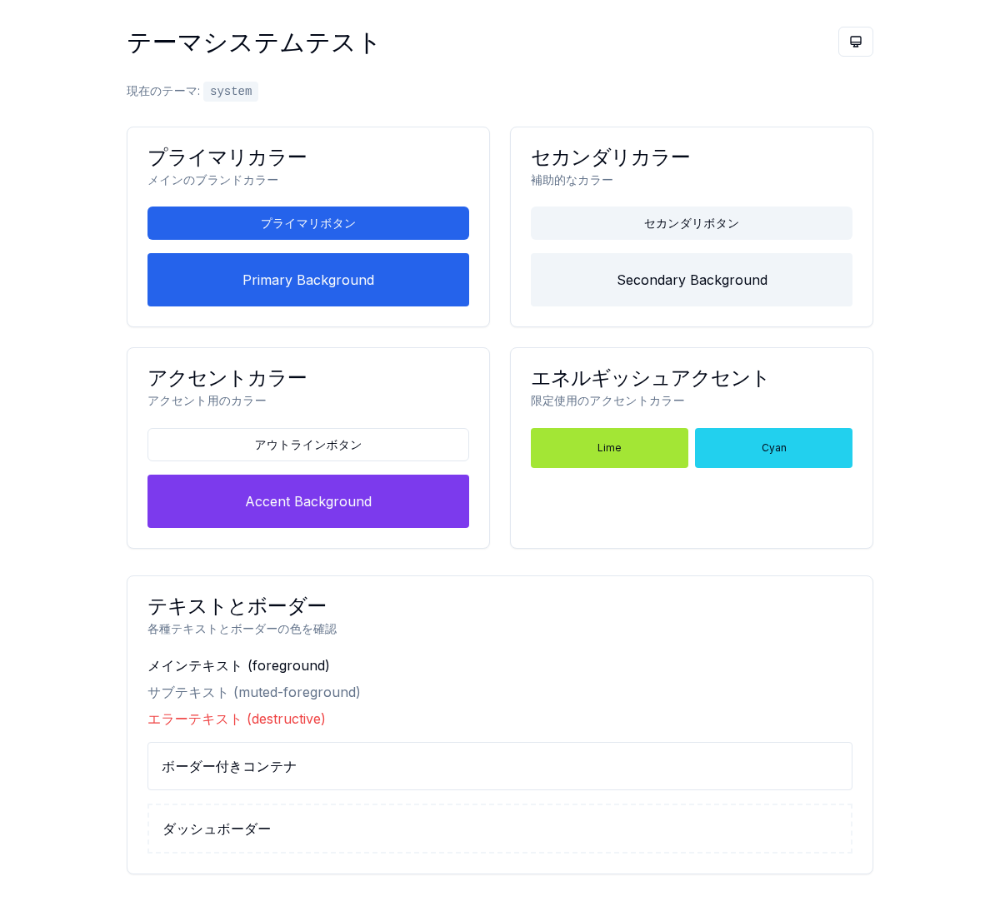
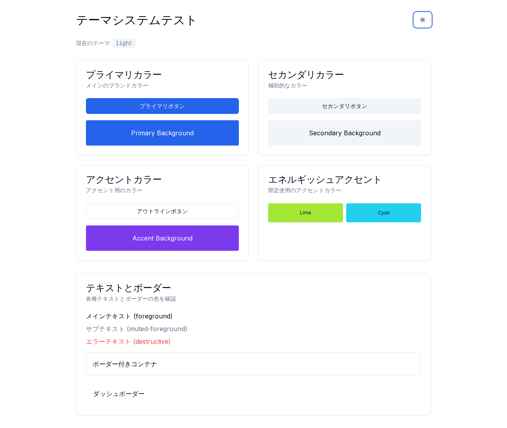
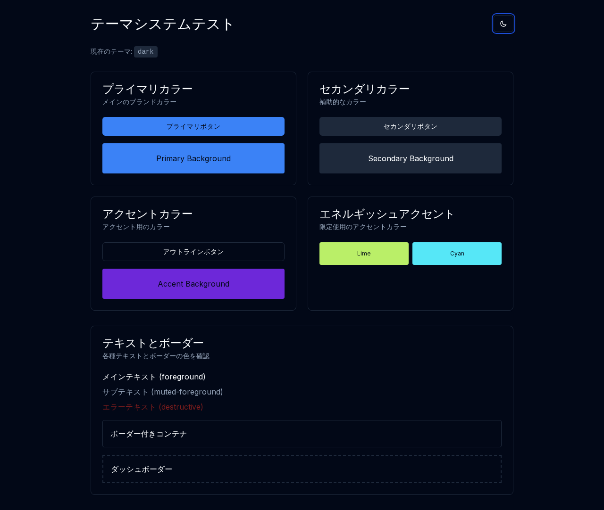
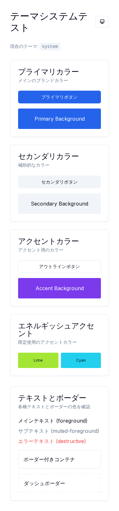

# T-016: Tailwind CSS Theme System E2E Screenshots

T-016で実装したTailwind CSSテーマシステムのE2Eテスト実行時に取得したスクリーンショットです。

## E2E テスト結果

全4テストケースがPASS:
- ✅ should display theme test page with all components (1.1s)
- ✅ should be keyboard accessible (1.6s)  
- ✅ should display responsive layout on different screen sizes (2.3s)
- ✅ should toggle between light and dark themes (3.4s)

## Screenshots

### Desktop Layout (1280x720)

### Light Theme

### Dark Theme  

### Mobile Responsive (375x667)

## 検証内容

- **カラーパレット表示**: プライマリ、セカンダリ、アクセント、エネルギッシュアクセントの各色が正常表示
- **テーマ切り替え**: ライト⟷ダーク⟷システムテーマの3モード切替が正常動作
- **キーボードナビゲーション**: Tab/Enter/Arrow キーでのアクセシビリティ確認
- **レスポンシブデザイン**: デスクトップとモバイルでの表示確認

## 技術詳細

- **Playwright E2E**: Dockerコンテナ内で実行
- **自動スクリーンショット**: 各テストケースで視覚的検証用画像を生成
- **HTML レポート**: 詳細な実行結果とトレース情報付き